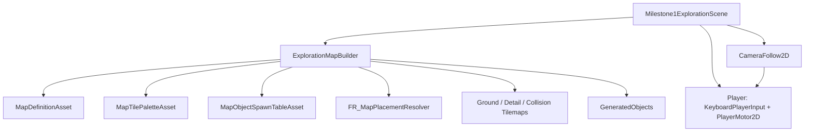

# Scene / Class Structure

## Milestone 1 Exploration

Scene: `Assets/Scenes/Milestone1ExplorationScene.unity`

## 責務

- Coreの `FR_` 型は、スロット抽選と配置結果の決定だけを担当する。
- Unity側Assetは、Tilemap表示、Prefab参照、Inspector編集用のデータを担当する。
- `ExplorationMapBuilder` はCore結果をTilemap/Prefab生成へ変換する。
- `PlayerMotor2D` は本番想定の移動処理として扱い、入力取得は `KeyboardPlayerInput` に分ける。
