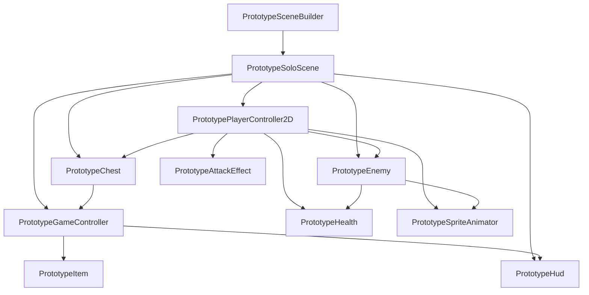

# Scene とクラス構成

## 現在の方針

Step 1 は一人用の最小プロトタイプとして、`PrototypeSoloScene` に仮実装を集約する。
将来的な本番構成とは分け、クラス名に `Prototype` を含めて本番用と混同しないようにする。

## 構成

## 入力経路

- `PrototypePlayerController2D` が Unity Input System の `Keyboard.current` を直接読む。
- 一旦キーボードのみ。将来、入力抽象化またはInput Actionsへ置き換える。
- 移動は `WASD` / 矢印キー。
- 攻撃は `Space`。
- 宝箱などの操作は `E`。

## 責務分担

- `PrototypeSceneBuilder`: 仮素材、固定小マップ、敵、宝箱、HUD、Build Settings登録をEditor上で生成する。
- `PrototypeGameController`: アイテム抽選、HUD更新、ゲームオーバー表示を受け持つ。
- `PrototypePlayerController2D`: プレイヤーの入力、移動、攻撃、インタラクト、報酬保持を受け持つ。
- `PrototypeEnemy`: プレイヤー追跡、接触ダメージ、撃破報酬を受け持つ。
- `PrototypeChest`: 宝箱の開封状態とアイテム抽選の起動を受け持つ。
- `PrototypeHealth`: HPの増減と死亡通知を受け持つ。
- `PrototypeHud`: 画面表示を受け持つ。
- `PrototypeSpriteAnimator`: プレイヤーと敵の仮スプライトを、移動状態に応じて差し替える。
- `PrototypeAttackEffect`: 攻撃時の斬撃表示を短時間だけ再生する。

## 要検討

- 本番実装では、HP、アイテム、戦闘、報酬計算を純C# Coreへ寄せる。
- プレイヤー入力はキーボード以外に対応する前に、Input Actionsへ集約する。
- Scene生成ツールで作った仮配置を、後でPrefab/Tilemap/正式Sceneへ移行する。
